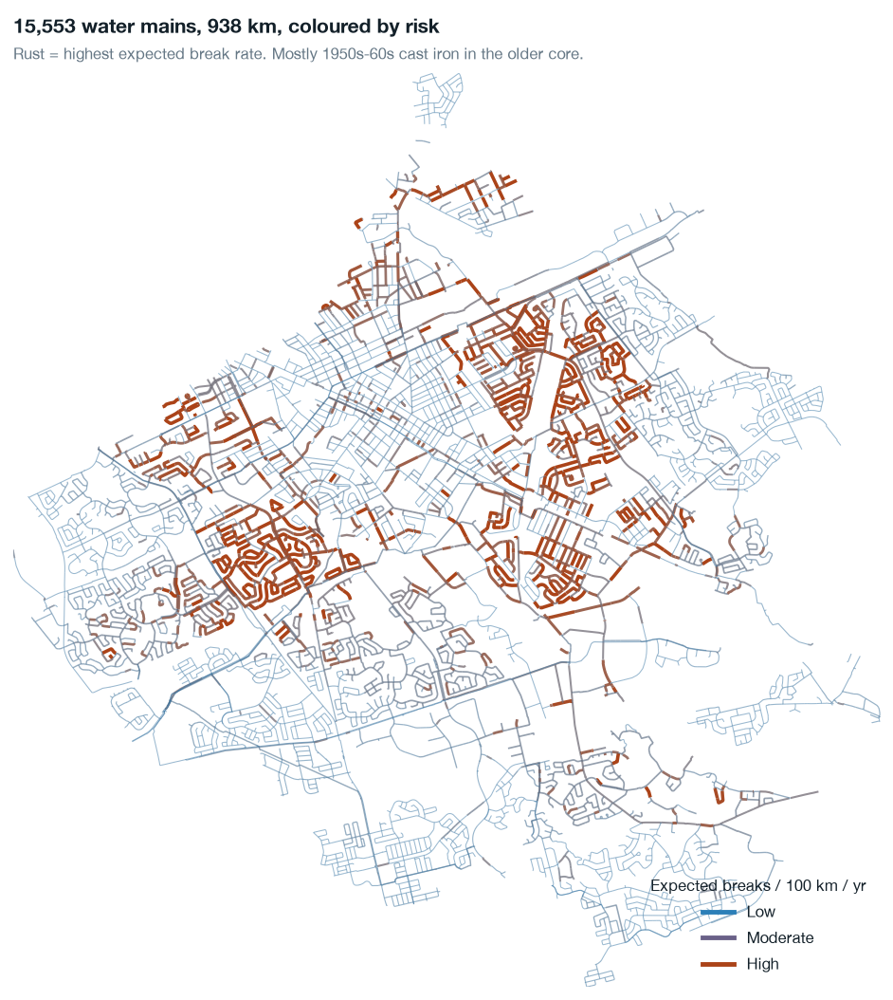
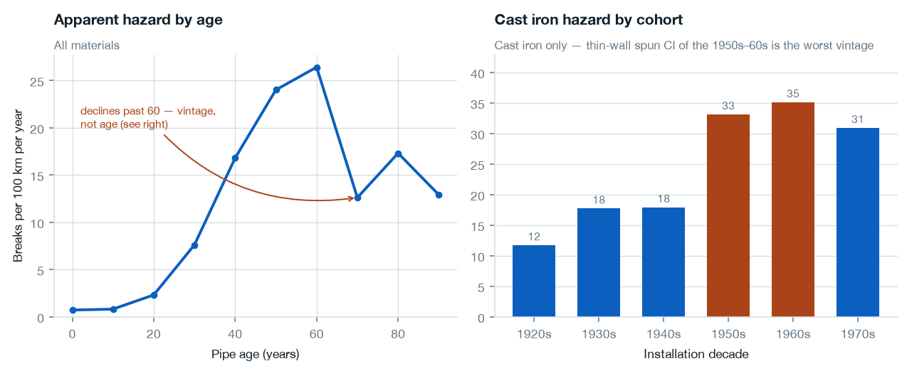

# Water main break risk — City of Kitchener

Which of Kitchener's 16,208 water mains should the city inspect next year, and what does inspecting them actually buy?



> **Inspecting the worst 47 km of the 938 km network covers about 30% of next year's breaks — six times what the same length picked at random would find, and 2.8× better than working oldest-pipe-first.**
>
> That number comes from a three-column SQL `GROUP BY`. A gradient-boosted model was built, evaluated across ten walk-forward years, and **lost** — so the lookup table is what ships. On the 90% of the network with no break history it beat LightGBM in 9 years out of 10.
>
> The largest caveat is up front, not buried: pipes that fail get replaced and leave the inventory, so **risk for the oldest cohorts is understated**. 311 break records are dated *before* the install year of the pipe now holding that asset ID.

---

## What this is

An end-to-end analytics engineering project on open municipal data: a live extract, a tested dbt warehouse, a scored inspection list, and an app the result is delivered through.

The unit of prediction is a **pipe-segment × year panel** — 340,150 rows at a 0.554% positive rate — not a table of break incidents. That change is what supplies negative examples: only 1,050 of 16,208 mains have ever broken, and the other 94% are the signal.

| | |
|---|---|
| **Network** | 16,208 mains · 938 km · installed 1889–2026 |
| **Breaks** | 2,925 confirmed main breaks, through 2026-09-02 |
| **Panel** | 340,150 complete pipe-years, 1997–2025 |
| **Tests** | 65 dbt data tests · 50 Python tests |
| **Refresh** | Weekly, automated |

## The result

Mean `capture@5%` across ten walk-forward years — the share of a year's breaks sitting in the worst 5% of network length. Random is 0.05 by construction.

| Method | All pipes | Never broken (94%) | Has broken (6%) |
|---|---|---|---|
| **Lookup table (shipped)** | **0.301** | 0.266 | **0.108** |
| LightGBM, all features | 0.281 | 0.206 | 0.064 |
| Rank by prior breaks | 0.299 | 0.176 | 0.105 |
| Rank by material × decade | 0.197 | **0.277** | 0.061 |
| Rank by age | 0.106 | 0.176 | 0.045 |
| Random | 0.052 | 0.054 | 0.059 |

**Read the two right-hand columns, not the left one.** Pipes that have broken before are 6% of pipe-years and 56% of breaks, so a method that merely re-finds them scores well overall while telling the city nothing its work-order system doesn't already contain. Split that way, the ML model is the worst of the serious options.

Full detail, including the leakage that had to be excluded: **[model card](docs/model-card.md)**.

## What the data says

**Cast iron survives normalisation.** 30.5 breaks per 100 km per year against PVC's 0.7 — 65% of breaks on 18% of the network.

**But age is the wrong way to rank it.** Cast iron hazard peaks at the **1950s–60s** cohort (33–35 per 100 km/yr) and falls away on both sides — 1920s pipe runs at 11.7. Pre-war pipe is thick-walled pit cast iron; the mid-century material is thin-wall spun cast. Ranking by age puts the wrong pipe at the top of the list.



**A pipe that has broken breaks again** — 4.3 → 49.6 per 100 km/yr from zero to three prior breaks, and the gradient survives holding material *and* cohort constant.

**Winter drives the annual total.** Freezing degree-days correlate 0.73 with the yearly break count; 56% of breaks fall in December–February against 25% if they were spread evenly. Weather is deliberately excluded from the ranking — next winter is unknown when the list is drawn.

More, with the counter-checks: **[analysis findings](docs/analysis-findings.md)**.

## The leakage worth knowing about

The inventory's own `condition_score` outranks every method here — 75% of breaks in the top 5% of never-broken network length. It is not skill. It is very nearly a function of break count:

| Lifetime breaks | 0 | 1 | 2 | 3 | 4 | 5 | 6 |
|---|---|---|---|---|---|---|---|
| Mean condition score | 9.02 | 6.35 | 5.68 | 5.05 | 5.01 | 4.80 | 4.48 |

Among pipes that had **never broken as of 2022**, those that went on to break in 2022–25 already carry a mean score of 7.17 against 9.02 for those that didn't. The snapshot is from September 2026 — the score was marked down in response to breaks that hadn't happened yet at prediction time. Using it would have made this project look twice as good and be worthless in the field.

## How it works

```
ArcGIS Feature Server ──┐
(mains, breaks, live)   │   extract/    paginated, geometry preserved
ECCC daily climate ─────┘              → partitioned parquet
                                              │
                        transform/     dbt + DuckDB
                          staging      sentinel decoding, MAIN-only filters
                          intermediate ASSETID→WATMAINID join, panel spine,
                                       as-of history, 250 m neighbourhoods
                          marts        dim_pipe, fct_break_incident,
                                       fct_pipe_year ← the training table
                          snapshots    SCD2 on the inventory
                                              │
                        ml/            walk-forward CV, ranker, scoring
                                       → main_scores.fct_pipe_risk_score
                                              │
                        app/           risk map · inspection list ·
                                       network health · model card
```

The join is the thing to get right. Breaks link to mains on `ASSETID → WATMAINID`, a 1:1 key. The original version of this project joined on `ROADSEGMENTID`, which carries up to **45 mains per segment** — a many-to-many join that expanded 2,766 break records into 10,761 rows with mostly-wrong pipe attributions.

## Run it

```bash
make setup      # venv + install
make build      # extract → dbt build → score → app bundle
make app        # open the Streamlit app
```

`make build` reproduces the entire warehouse from the live APIs in about a minute. Nothing under `data/` is committed. Individual steps: `make extract`, `make transform`, `make score`, `make figures`, `make test`, `make lint`.

A [weekly GitHub Action](.github/workflows/refresh.yml) runs the same chain and commits the refreshed app bundle.

## What this cannot tell you

- **Rank within a risk cell is meaningless.** Every segment in a cell shares one rate; reversing the tiebreak moves `capture@5%` by under a point. The list is a set of cells to work through, not a league table of pipes.
- **Survivorship.** Failure-prone pipe has been progressively replaced and removed from the record. Risk for the oldest cohorts is understated and this cannot be fixed with the available data — only measured.
- **Attributes are today's.** Historical pipe-years are scored with the current inventory. A snapshot has started accumulating point-in-time values, but only from its first run forward.
- **20–40 breaks a year** land in the stratum that matters. Any single year is noise; everything here is ten-year walk-forward for that reason.
- **No soil, pressure-transient, traffic-loading or repair-cost data.** Their absence is the most plausible reason a flexible model can't beat three columns.
- **Kitchener only.** Waterloo is a separate municipality with its own portal — the project name is historical.

## Repository

| Path | |
|---|---|
| [`extract/`](extract/) | ArcGIS + ECCC extraction to partitioned parquet |
| [`transform/`](transform/) | dbt project — staging, intermediate, marts, snapshots, tests |
| [`ml/`](ml/) | Features, baselines, walk-forward evaluation, ranker, scoring |
| [`analysis/`](analysis/) | Queries and figures |
| [`app/`](app/) | Streamlit app and its data bundle |
| [`docs/project-plan.md`](docs/project-plan.md) | The nine-phase plan this was built to |
| [`docs/model-card.md`](docs/model-card.md) | Results, leakage, limitations |
| [`docs/analysis-findings.md`](docs/analysis-findings.md) | Phase 3 findings with counter-checks |
| [`docs/data-profile-breaks.md`](docs/data-profile-breaks.md) | Source data profile |

## Sources

- [Water Main Breaks](https://open-kitchenergis.opendata.arcgis.com/datasets/KitchenerGIS::water-main-breaks/about) — City of Kitchener Open Data
- [Water Mains](https://open-kitchenergis.opendata.arcgis.com/datasets/KitchenerGIS::water-mains/about) — City of Kitchener Open Data
- [Historical climate data](https://climate.weather.gc.ca/) — Environment and Climate Change Canada, spliced across three stations because no single one covers 1996–present

---

*A personal project. Conclusions are my own and are not a recommendation to any person or organisation.*
