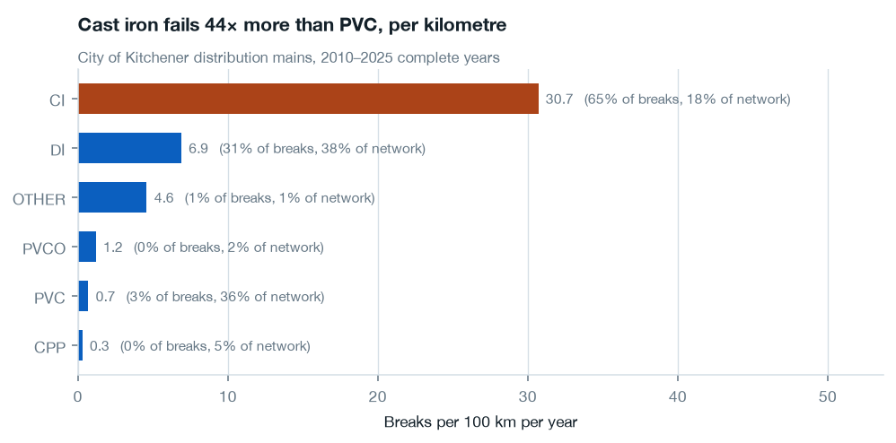
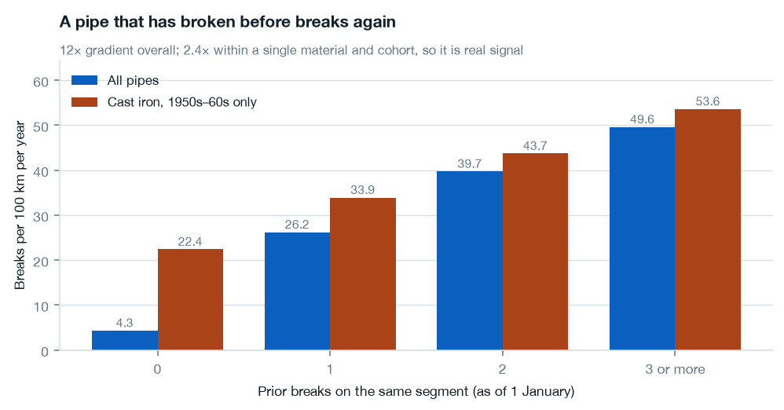
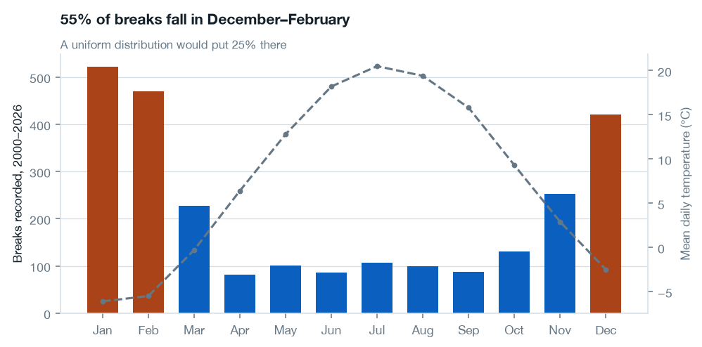
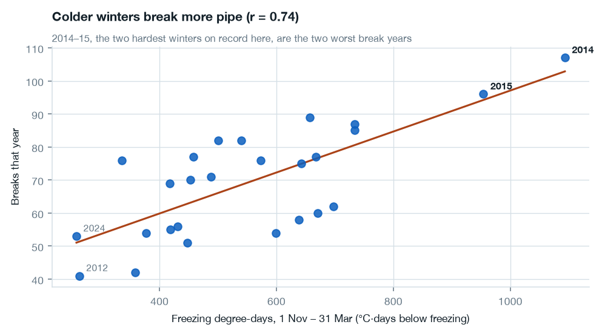
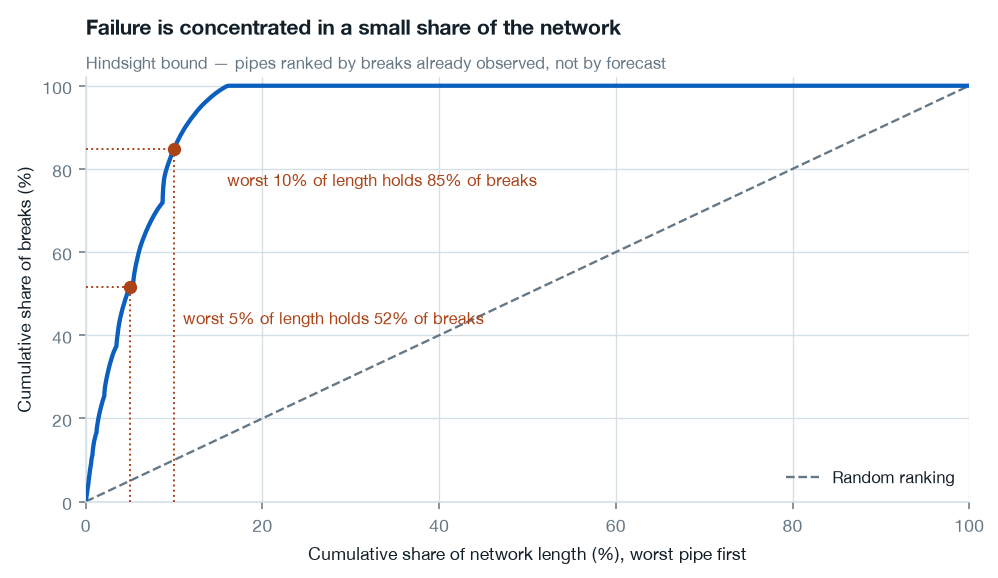
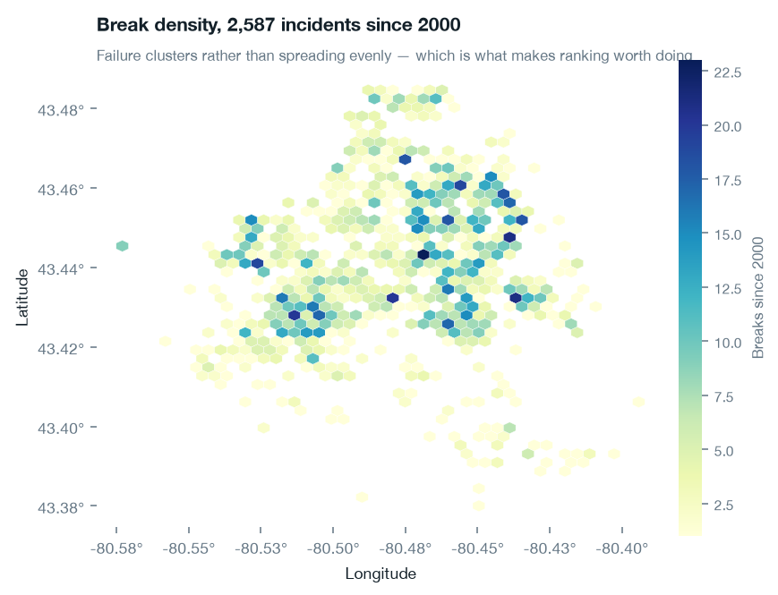

# Analysis findings — phase 3

Everything below is computed by `analysis/queries.py` against the marts and rendered by `make figures`. Rates are **breaks per 100 km per year**, the unit water utilities benchmark on. Sub-metre segments (655 GIS connector artifacts, shortest 0.9 mm) are excluded from every rate; incomplete years are excluded from every aggregate.

---

## 1. Cast iron survives normalisation

Raw counts always show cast iron dominating, which proves nothing on its own — the question is whether it fails more *per kilometre*. It does, by a wide margin.

| Material | Rate /100 km/yr | Share of breaks | Share of network |
|---|---|---|---|
| CI | **30.7** | 65% | 18% |
| DI | 6.9 | 31% | 38% |
| PVC | 0.7 | 3% | 36% |

Cast iron carries 18% of the network length and 65% of the failures — a 44× rate difference against PVC.

## 2. The age curve is confounded by vintage

Read alone, the age curve says something implausible: failure risk climbs to age 60 and then **declines**. Taken at face value that would mean the oldest pipe in the ground is safer than middle-aged pipe.

Holding material constant and cutting by installation decade explains it. Within cast iron:

| Cohort | Rate /100 km/yr | Mean age |
|---|---|---|
| 1920s | 11.7 | 87 |
| 1930s | 17.7 | 79 |
| 1940s | 17.9 | 65 |
| **1950s** | **33.1** | 58 |
| **1960s** | **35.1** | 49 |
| 1970s | 30.9 | 40 |

Hazard peaks at the 1950s–60s cohort and falls away on both sides. Pre-war pipe is thick-walled pit cast iron; the mid-century material is thin-wall spun cast iron, and it is roughly **twice as failure-prone as cast iron laid thirty years earlier**.

**This matters directly for phase 4.** Ranking by age — the obvious baseline — puts 1920s pipe at the top of the inspection list when 1950s–60s pipe is nearly 2× riskier. The baseline is not merely beatable; it is wrong at the top, which is the only part of a ranked list anyone acts on. Install decade should be a feature in its own right, not a proxy absorbed by age.

Survivorship is a second, smaller contributor: pipes replaced after failing leave the inventory, so the oldest surviving cohort is selected for durability. That effect cannot be separated from the vintage effect with this data, and both push the same way.

## 3. Break history is the strongest single predictor

| Prior breaks (as of 1 Jan) | All pipes | CI, 1950s–60s only |
|---|---|---|
| 0 | 4.3 | 22.4 |
| 1 | 26.2 | 33.9 |
| 2 | 39.7 | 43.7 |
| 3+ | 49.6 | 53.6 |

A 12× gradient overall. The obvious objection is that pipes which have broken before are just old cast iron — but holding material *and* cohort constant, the gradient is still 2.4×. Break history carries information beyond age, material and vintage.

`prior_break_count` is computed strictly as-of 1 January of the panel year, so this is a forecast-safe relationship rather than a retrospective one.

### The predecessor counter-check

Locations whose *previous* pipe broke — where the failed segment was replaced — now run at **1.8** per 100 km/yr against a network average of 8.7. The replacements work.

This is why `prior_break_count` and `predecessor_break_count` are separate columns. Merging them (the natural thing to do when an asset ID is reused) would have handed the model a strongly inverted signal: it would learn that recently-replaced PVC is high risk, when it is the safest pipe in the network.

## 4. Winter drives the annual total

56% of breaks fall in December–February against 25% under a uniform distribution.

Across 26 years, **freezing degree-days correlate r = 0.73 with the annual break count**. The two hardest winters on record here, 2014 and 2015, are the two worst break years — 2014 being the season the project README cites at $1.6M in repairs.

One correction to the plan's assumption: **freeze-thaw day count is negatively correlated with breaks (r = −0.24)**. The textbook mechanism (cycling works joints loose) is real, but in this climate a winter with many zero-crossings is a *mild* winter — the ground never freezes deep. Frost penetration, measured by accumulated degree-days below freezing, is the variable that tracks failures. Freeze-thaw count should not be used as a severity proxy here.

## 5. Failure is concentrated, which is what makes ranking worth doing

Ranking pipes by observed lifetime break count:

| Share of network length | Share of all recorded breaks |
|---|---|
| Worst 5% | **52%** |
| Worst 10% | **85%** |

**This is a hindsight bound, not a model result.** It ranks pipes by failures already observed, so it measures how concentrated failure is — the ceiling a perfect ranking would have reached knowing the answers in advance. Phase 4 measures the forecastable version: ranking on features known before the year begins, scored on a held-out year.

It is still the number that justifies the project. If failures were spread evenly, no inspection list could beat random, and there would be nothing to build.

The profile of repeat offenders is consistent with everything above:

| History | Pipes | Mean install year | % cast iron |
|---|---|---|---|
| 4+ breaks | 146 | 1961 | 77% |
| 2–3 breaks | 310 | 1963 | 65% |
| 1 break | 592 | 1968 | 47% |
| Never broken | 14,504 | 1995 | 9% |

---

## What this changes for phase 4

1. **The age baseline is weaker than it looks, and wrong where it counts.** Ranking by install decade — or by `material × decade` — is the honest baseline to beat, not age.
2. **`prior_break_count` will likely dominate the model.** It should, but it also means the model will say little about pipes that have never broken, which are 90% of the network. Per-cohort evaluation needs to report performance separately for pipes with and without break history.
3. **Use freezing degree-days, not freeze-thaw counts,** for the weather-sensitivity model. The plan's §6 recommendation (structural model for the forward list, weather model for a scenario toggle) stands.
4. **Keep the two break-history counts separate.** Merging them inverts the signal.
